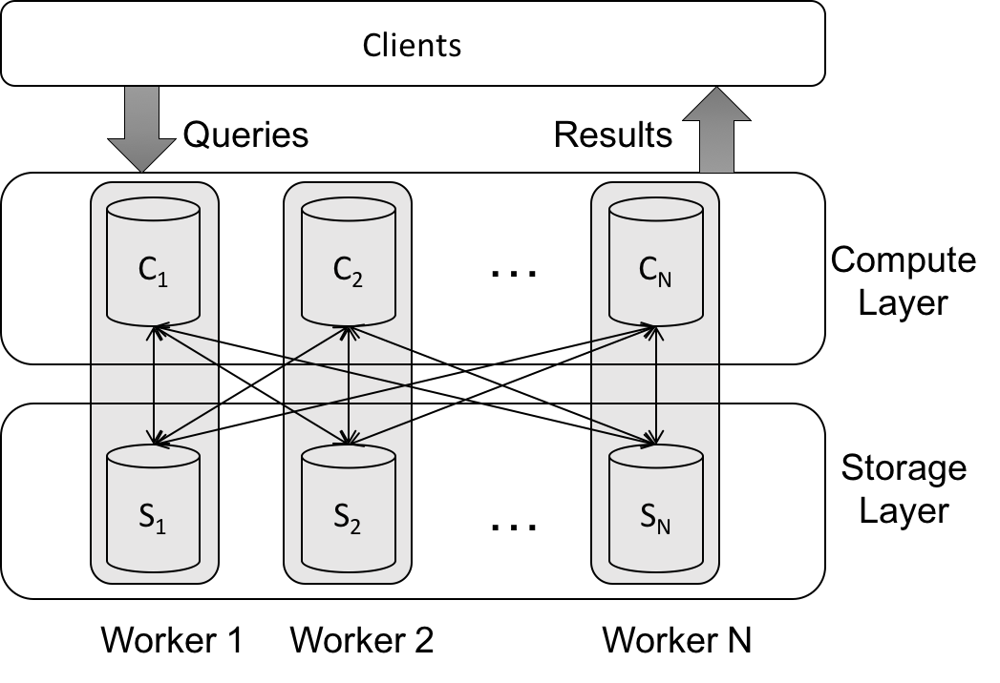

# Streaming Graph Partitioning

Experimental framework for performance analysis of graph partitioning algorithms on graph computations. This framework has been developed as a part of an experimental study focusing on streaming algorithms for graph partitioning. For more details, please refer to our SIGMOD'19 paper:

```
Anil Pacaci and M. Tamer Özsu. 2019. Experimental Analysis of Streaming Algorithms for Graph Partitioning. 
In 2019 International Conference on Management of Data (SIGMOD ’19), 
June 30-July 5, 2019, Amsterdam, Netherlands. 
ACM, New York, NY, USA, 18 pages. https://doi.org/10.1145/3299869.3300076
```

####  Organization

This testbed has two main components with different infrastructure based on the target workload: PowerLyra cluster for offline graph analytics and JanusGraph cluster for online graph queries.

[PowerLyra](https://github.com/realstolz/powerlyra) is a distributed graph computation engine that employs differentiated computation and partitioning on skewed graphs. We added an edge-cut based computation engine and set of partitioning algorithm used in the paper to provide fair comparison between the edge-cut and the vertex-cut partitioning models. Modified version of PowerLyra used in our SIGMOD'paper can be accessed [here](https://github.com/anilpacaci/powerlyra).

[JanusGraph](https://janusgraph.org/) is a distributed graph database optimized for storing and querying graphs across a multi-machine cluster. We modified the explicit partitioning [option](https://docs.janusgraph.org/latest/graph-partitioning.html) of JanusGraph to enable vertex to partition mapping to be provided by a third-party algorithm. We used Cassandra backend with range partitioning [ByteOrderedPartitioner](https://docs.datastax.com/en/archived/cassandra/2.1/cassandra/architecture/architecturePartitionerBOP_c.html). Modified version of the JanusGraph used in or SIGMOD paper can be accessed [here](https://github.com/anilpacaci/janusgraph).

All the components are dockerized and bash scripts to automate initializing, running experiments etc. are provided.


#### Prerequisites

It is recommended to use Linux 16.04 LTS.

Please refer to PowerLyra and JanusGraph documentation for manual setups.

For automated docker setup, cluster of machines with Docker 18.09.5 is required.

Please make sure that Docker can be used as a non-root user in all the machines in the cluster, for details: [Docker](https://docs.docker.com/install/linux/linux-postinstall/#manage-docker-as-a-non-root-user) 

In addition, automated scripts assume that passwordless ssh is setup between all machines in the cluster, for more details on how to setup passwordless ssh: [passwordless-ssh](http://www.linuxproblem.org/art_9.html).

#### Datasets

We use the following datasets in our experiments in the SIGMOD'19 paper:

|  Dataset  | Edges | Vertices | Max Degree |     Type     |
|:---------:|:-----:|:--------:|:----------:|:------------:|
|  Twitter  | 1.46B |    41M   |    2.9M    | Heavy Tailed |
| UK2007-05 | 3.73B |   105M   |    975K    |   Power-law  |
|  US-Road  | 58.3M |    23M   |      9     |  Low-degree  |
|  LDBC SNB SF1000 |  3.6M |   447M   |    3682    | Heavy Tailed |


Download Links:
  - Twitter: https://an.kaist.ac.kr/traces/WWW2010.html
  - UK2007-05: http://law.di.unimi.it/webdata/uk-2007-05/
  - USA-Road Network: http://users.diag.uniroma1.it/challenge9/download.shtml
  - LDBC SNB: https://github.com/ldbc/ldbc_snb_datagen

All datasets are in edge-list format by default. Edge-cut streaming graph partitioning algorithms requires adjacency list representation, where each line represents a vertex and all of its outgoing edges:

`vertex_id neighbour_1_id neighbour_2_id ... neighbour_n_id`

We provide Spark scripts to convert from edge list format to adjacency list format. It simply uses `groupbyKey` to group all edges by the source vertex.
See [csv-converter](https://github.com/anilpacaci/streaming-graph-partitioning/tree/master/csv-converter)

Note: We only use the friendship network (`person_knows_person` relationship) of the LDBC synthetic dataset. File with the friendship information can be find `social_network/person_knows_person_0_0.csv` in the generated dataset.

## Offline Graph Analytics

`container/analytics` contains the Dockerfile and necessary files to build the PowerLyra docker image. Image is based on the modified version of the PowerLyra, used in our SIGMOD'19 paper. In a nutshell, image is a base Ubuntu 16.04 image, with `openmpi` libraries and PowerLyra binary executables compiled from [PowerLyra](https://github.com/anilpacaci/powerlyra/) installed. 
In addition, it includes `ssh` configuration to enable passwordless communication between PowerLyra Docker instances, and utility scripts to collect and process system logs.

`container/scripts` contains `swarm.sh`, the bash script that automates experiments, and `swarm.conf`, configuration parameters necessary to execute offline analytics experiments. 

#### Parameter Setup

Main configuration files are the `scripts/analytics/swarm.conf`, which is read by `swarm.sh` script and `containers/analytics/docker-compose.yml`. 

Following parameters have default values and therefore not recommended to change. Any change should be propagate to `containers/analytics/docker-compose.yml`

* PROJECT_NAME: Name of the stack to be deployed to Swarm. Default: `powerlyra`
* PL_MASTER_NAME: Master Service name, default: `powerlyra-master`
* PL_WORKER_NAME: Worker Service name, default: `powerlyra-worker`
* NETWORK_NAME: Name of the overlay network to be created, default `powerlyra-network`
* IMAGE_TAG: Name and tag of the PowerLyra docker image, it will be deployed on local private repository. Default:  `127.0.0.1:5000/powerlyra`
* IMAGE_FILE: Folder containing the docker build file and other necessary files `../../containers/analytics`
* SERVICE_COMPOSE_FILE: Docker stack definition to be deployed to Swarm cluster `../../containers/analytics/docker-compose.yml`

Following parameters **have to be configured** by the user.

* SWARM_MANAGER_IP: IP address of the machine running the experiments. This machine will be used as the Docker Swarm Leader and PowerLyra MPI cluster master.
* DOCKER_WORKER_NODES: File containing list of IP address (except the master node above) of the machines in the cluster. Remember that passwordless ssh needs to be setup between machines in this list.

`containers/analytics/docker-compose.yml` contains three parameters that **have to be configured** by the user. These are the directories in the host filesystem that will be mounted to PowerLyra images:

* `volumes.datasets.driver_opts.device`: Directory in host machine that contains the graph datasets to be used in the experiments.
* `volumes.parameters.driver_opts.device`: Directory in the host machine that contains experiment configuration files. 
* `volumes.results.driver_opts.device`: Directoy in the host machine in which output of experiments are logged.

Note: For any configuration file or dataset, always use the **relative** path under the directories specified above. 

#### Experiment Setup
Experiments are configured using a `json` configuration value under the directory specified in `volumes.parameters.driver_opts.device` setting. Each configuration file defines an experiment over a single dataset with multiple values for all other parameters. An example configuration:

```javascript
{
	"name" : "soc-pokec",
	"runs" : {
		"snap-dataset" : "soc-pokec/soc-pokec-snap-combined.txt",
		"adj-dataset" : "soc-pokec/soc-pokec-adjacency-combined.txt",
		"log-folder" : "soc-pokec-logs",
		"result-file" : "soc-pokec-test-run",
		"nedges" : "30622564",
		"nvertices" : "1432693",
		"worker-per-node" : 1,
		"workers" : [4,8,16],
		"ingress" : [
      {"name" : "hdrf"},
      {"name" : "random"},
			{"name" : "fennel"}
		],
		"algorithm" : [
			{
				"name" : "pagerank",
				"iterations" : 20
			},
			{
				"name" : "sssp",
				"source": 1
			},
			{"name" : "connected_component"}
		]
	}
}
```
This configuration file defines 18 individual runs over the soc-pokec [dataset](https://snap.stanford.edu/data/soc-Pokec.html). `snap-dataset`, `adj-dataset`, `log-folder`, and `result-folder` are all relative paths under the directories defined in `docker-compose.yml` file. It uses `HDRF`, `Random` and `FENNEL` partitioning algorithms with PageRank and Weakly Connected Components algorithm. For each combination, three different configurations for cluster size is defined via `workers` parameter.

#### Run Experiments

First change working directory to `scripts/analytics` and make sure that `swarm.conf` is defined in the same directory.

* To print the help message:
```$ ./swarm.sh usage```

* To initalize the Swarm Cluster:
```$ ./swarm.sh init```
It starts the Swarm leader in the given node, then adds every node in the `DOCKER_WORKER_NODES` as Swarm workers. In additions, it creates an overlay network that connects Docker PowerLyra images.

* Build PowerLyra Docker image

```$ ./swarm.sh build```

It starts a private docker service registry in the master machine, then builds and deploys the PowerLyra docker image to this registry where worker nodes can pull the built contaier.

* Start PowerLyra Cluster service

```$ ./swarm.sh start```

Start a PowerLyra instance on each node defined in `DOCKER_WORKER_NODES`.

* Run experiemnts

```$ ./swarm.sh run config_file```

Run a set of experiments defined in `config_file`. Note that `config_file` must be a **relative** path under `volumes.parameters.driver_opts.device` directory.

* Stop PowerLyra containers and Service

```$ ./swarm.sh stop```

Stop PowerLyra container and the PowerLyra service in the Swarm cluster.

* Cleanup Swarm Cluster

```$ ./swarm.sh destroy```

Removes the overlay network and forces each node in the cluster to leave the swarm.

#### Manual Runs

If you want to add additional partitioning algorithms and/or offline graph analytic tasks, you should moodify the PowerLyra [codebase](https://github.com/anilpacaci/powerlyra/). More instructions on how to compile/build PowerLyra can be find [here](https://github.com/realstolz/powerlyra/blob/master/TUTORIALS.md)

It is possible to use the Docker images and scripts provided in this repository with a modified PowerLyra version. Once the modified PowerLyra codebase is compiled and new binaries are generated, deploy the release binaries under `containers/analytics/powerlyra` folder, then follow the steps described above to build Docker images and run experiments.

## Online Graph Queries

Setup used in our SIGMOD'19 paper consists of a JanusGraph instance (version 0.3.0) and a Cassandra (version 2.1.9) instance for each node in the cluster:



JanusGraph does not support graph partitioning algorithms, therefore we modified JanusGraph to use an external partitioning information (provided by a file, loaded into Memcached etc.) during the graph loading phase. You can access the modified JanusGraph source code [here](https://github.com/anilpacaci/janusgraph), adn the Tinkerpop Gremlin Drivers [here](https://github.com/anilpacaci/tinkerpop/tree/intelligentrouter-3.3.1).

We provide a trivial implementations of edge-cut SGP algorithms (Hash, FENNEL and LDG). First, set the configuration parameters under `src/main/resources/sgp.properties`. Then run following to produce a partitionig mapping that is ready to use by JanusGraph scripts:

```
$ mvn clean assembly:assembly
$ mvn exec:java -Dexec.mainClass="ca.uwaterloo.cs.sgp.streaming.EdgeCutSGP" -Dexec.args="sgp.properties"
```


#### Dockerized JanusGraph Experiments

**TODO May 16, 2019**: Dockerized version of the JanusGraph cluster will be added.

#### Manual Runs

In each JanusGraph instance, explicit partitioning should be enabled by setting:
```
ids.placement=org.janusgraph.graphdb.database.idassigner.placement.PartitionAwarePlacementStrategy
ids.placement-history=[memcached|inmemory]
ids.placement-history-hostname=192.168.152.153:11211
ids.loader-mapping=[memcached|inmemory]
ids.loader-mapping-hostname=192.168.152.153:11211
```

It enables graph loaders to use explicit mapping loaded into Memcached. This way, any partitioning scheme produced by an external algorithm can be enforced on JanusGraph vertex-to-machine allocation scheme.

In addition, JanusGraph client driver uses the `Partition-Aware routing strategy` (modified Tinkerpop library with the partition aware router can be found [here](https://github.com/anilpacaci/tinkerpop/tree/intelligentrouter-3.3.1)) that routes queries based on the location of the start vertex of the query. It is a necessary step as JanusGraph  routes queries to a random instance by default. 

Cassandra instances are configured to use `ByteOrderedPartitioner` to enable range partitioning. By defalt, JanusGraph divides the entire key space of Cassandra to equal partitions, and computes an `id` from a particular partitions range to enforce vertex placement on a particular partition. In order to set `ByteOrderedPartitioner`, change `conf/cassandra.yaml` under Cassandra installation on  each node:

`partitioner: org.apache.cassandra.dht.ByteOrderedPartitioner`

`scripts/interactive` contains following scripts for graph loading:

* `ADJParser.groovy`: Imports a graph in adjacency list format
* `SNBParser.groovy`: special importer for graph generated by LDBC SNB data generator.
* `PartitionLookupImporter.groovy`: Uploads generated partitioning information into a Memcached instance, from which JanusGraph instances can read during graph loading and query routing

`scripts/interactive/snb.conf` contains the parameters for execution of the loader scripts:
* `partition.lookup`: Partition lookup file generated by the execution of `EdgeCutSGP` program. Used by `PartitionLookupImporter.groovy`
* `memcached.address`: [IP_ADDR]:[PORT] for the memcached instance to be used to store partition lookup information
* `input.base`: Directory contaning input files
* `nodes`: List of files that contain vertex infromation under `input.base`. Used by `SNBParser.groovy`
* `edges`: List of files that contain edge infromation under `input.base`. Used by `SNBParser.groovy`
* `thread.count`: Number of graph loader threads.

